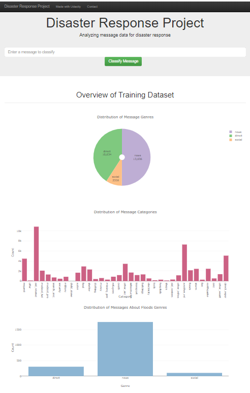
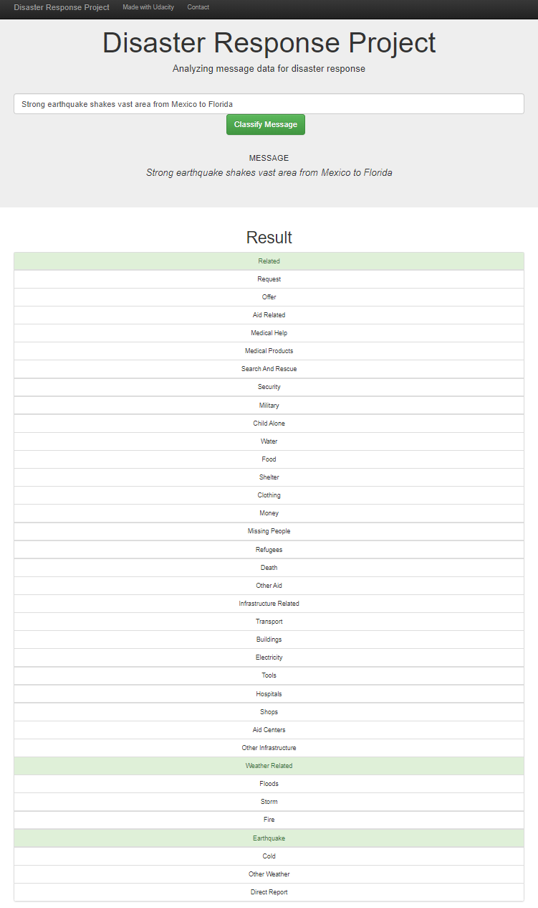

# Project 2 Disaster Response Pipeline Project

Files of Project 2 (Disaster Response Pipeline Project) for Udacity Data Science Nanodegree

### Table of Contents

1. [Installation](#installation)
2. [Project Motivation](#motivation)
3. [File Descriptions](#filedesc)
4. [How To Interact With The Project](#howto)
5. [Licensing, Authors, and Acknowledgements](#licensing)

## Installation <a name="installation"></a>

Libraries used in this project:

- sqlalchemy
- re
- numpy
- pandas
- nltk
- sklearn
- pickle
- json
- plotly
- flask

Python v3.* is used for building the project.

## Project Motivation <a name="motivation"></a>

In this project made for Udacity Nanodegree program I analyzed disaster data from Figure Eight to build a model for an API that classifies disaster messages.

In the Project I observed a data set containing real messages that were sent during disaster events. I created a machine learning pipeline to categorize these events.

The project includes a web app where an emergency worker can input a new message and get classification results in several categories. The web app also displays visualizations of the data.

## File Descriptions <a name="filedesc"></a>

The repository files have the following structure:

```
└── app/
    └── templates/
        ├── go.html
        ├── master.html
    ├── run.py
└── data/
    ├── disaster_categories.csv
    ├── disaster_messages.csv
    ├── DisasterResponse.db
    ├── process_data.py
└── models/
    ├── classifier.pkl
    ├── train_classifier.py
└── pipeline/
    ├── ETL Pipeline Preparation.ipynb
    ├── ML Pipeline Preparation.ipynb
    ├── categories.csv
    ├── messages.csv
└── README.md
└── classification.png
└── visualisations.png
```

## How To Interact With The Project <a name="howto"></a>

### Project overview.

1. ETL Pipeline - a data cleaning pipeline that:

- Loads the messages and categories datasets
- Merges the two datasets
- Cleans the data
- Stores it in a SQLite database

2. ML Pipeline - a machine learning pipeline that:

- Loads data from the SQLite database
- Splits the dataset into training and test sets
- Builds a text processing and machine learning pipeline
- Trains and tunes a model using GridSearchCV
- Outputs results on the test set
- Exports the final model as a pickle file

3. Flask Web App - much of the flask web app is provided by Udacity. I added data visualizations using Plotly in the web app. 

### Instructions:

1. Run the following commands in the project's root directory to set up your database and model.

    - To run ETL pipeline that cleans data and stores in database
        `python data/process_data.py data/disaster_messages.csv data/disaster_categories.csv data/DisasterResponse.db`
    - To run ML pipeline that trains classifier and saves
        `python models/train_classifier.py data/DisasterResponse.db models/classifier.pkl`

2. Run the following command in the app's directory to run your web app.
    `python run.py`

3. Go to http://0.0.0.0:3001/

### Screenshots of working web app

1. Visuallisations


2. Classification results


## Licensing, Authors, Acknowledgements <a name="licensing"></a>

I would like to express the deepest appreciation to the Udacity team for giving the opportunity to create this project. 
Also I would like to thank [Figure Eight](https://www.figure-eight.com/) for providing dataset for the project.